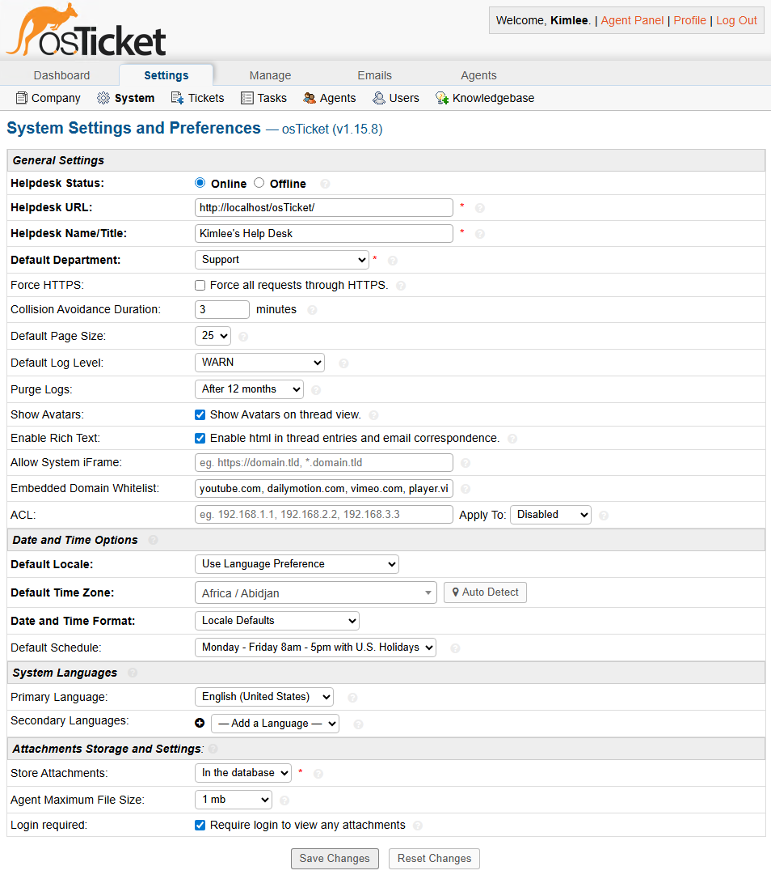
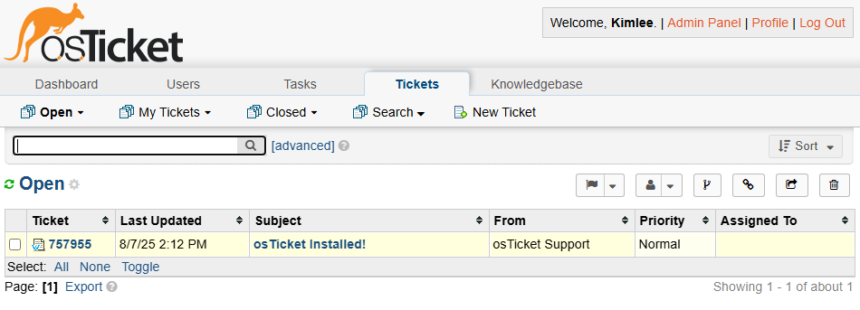

# osTicket - Post Installation Configuration
This tutorial outlines the post-installation configuration of the help desk ticketing system: osTicket. We will explore the configuration, permission settings, agent and admin panel, and SLAs of osTicket.

## Installation Steps

*NOTE: Make sure to complete the instructions from [prerequisites-installation.md](https://github.com/KimleeHeng/osticket-instructions/blob/main/prerequisites-installation.md) prior to this guide*

_Admin/Analyst Login Page: http://localhost/osTicket/scp/login.php_

_End Users osTicket URL: http://localhost/osTicket/_

---
## Acknowledging Agent Panel vs Admin Panel

In osTicket, there are two separate panels, the **admin panel** and **end user panel**.

The admin panel is used by system administrators and support staff to manage the entire ticketing system. Some of the responisbilities include **system settings**, **user and role management**, and **department management**.

The end user panel is used by support agents to manage and resolve tickets that are submitted by the end user. Some key features include **ticket management**, **ticket assignment**, **knowledgebase access**, and **communication with end users**.

The admin and agent panels also differs in user interfaces as well. The admin panel has more features and access to system and user configurations compared to the agent panel.

**Admin Panel**

**Agent Panel**

---
## Acknowledging Agent Panel vs Admin Panel
