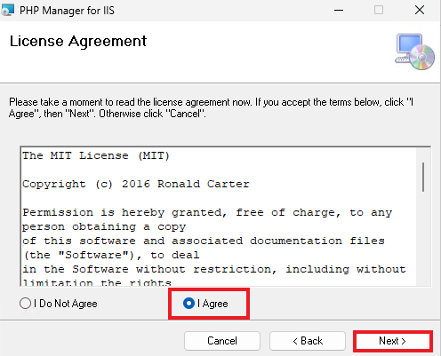
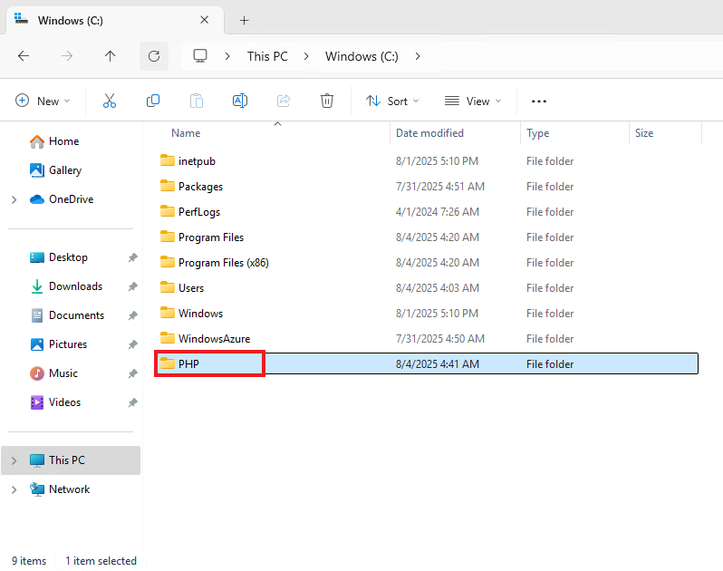
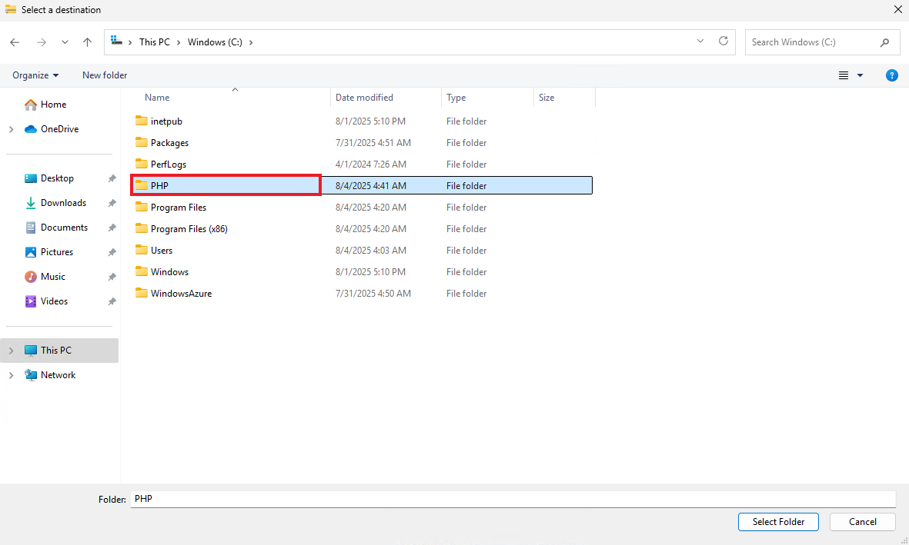

# osTicket - Prerequisites and Installation
This tutorial outlines the prerequisites aand installation of the help desk ticketing system: osTicket.

## Installation Steps

*NOTE: Ensure that you are logged into your Microsoft Azure account, have a subscription active and have already made a resource group for your virtual machine.*

---
### Step 1: Create a new Virtual Machine within Azure

1.1 Search for "Virtual Machine" in the search bar, or navigate to the Virtual Machine section back on the home page.

1.2 On the Virtual Machine page, click **Create**, and then select **Virtual machine**.

1.3 Fill out the following information:
- Subscription - Select your current and active subscription
- Resource Group - Select your resource group/make a new one
- Virtual machine name - For this lab, we will name our VM:  **"osticket-vm"**
- Region - Select your current region. For this lab, we will select **"(US) East US"**
- Availablity Zone - Select **"Zone 3"**
- Image - Select **"Windows 11 Pro, version 24H2 - x64 Gen2"**
- Size - Select **"Standard_D2s_v3 - 2vcpus, 8GiB memory ($70.08/month)"**

Create your **Administrator account**.

- For this lab, we will use **labuser** as the username and **osTicketPassword1!** as the password.

Check off the Licensing check box

Click **Review + Create** to proceed

1.3 Confirm that **Validation passed** for your virtual machine.

Review the the information you inputted, ensuring everything is correct.

Click **Create** once more to initialize deployment of your virtual machine.

**A Windows 11 Virtual Machine has now successfully been created.**

## Step 2: Use Remote Desktop to connect to your Windows 11 Virtual Machine

2.1 On your Virtual Machine page within Azure, you will be able to see the designated Public IP Address for each virtual machine created.

Use the Windows 11 Virtual Machine's IP address to log in through Remote Desktop

2.2 A small windows security prompt will ask you to enter your credentials to log into the virtual machine

- We will use the username and password that we made when creating the virtual machines **(labuser/osTicketPassword1!)**

Another windows prompt will appear, click **Yes** to proceed

Power on the Windows 11 virtual machine and proceed with the setup steps until you reach the Windows Desktop.

2.3 Within the VM (osticket-vm), download the [osTicket-Installation-Files.zip](https://drive.google.com/uc?export=download&id=1b3RBkXTLNGXbibeMuAynkfzdBC1NnqaD) and unzip it onto your desktop. The folder should be called “osTicket-Installation-Files”
We will use the files in this folder to install osTicket and some of the dependencies.

## Step 3: Install / Enable IIS in Windows with CGI

IIS (Internet Information Systems) is a web server software for hosting websites and web applications on Windows systems. For this lab we will be enabling IIS using CGI (Common Gateway Interface) to bridge the web server and our application, osTicket. This is essential in order to host our application.

3.1 Open up Control Panel from the Windows Start Menu

From here navigate through the following pathway: **Control Panel\Programs\Programs and Features**

Then on the left hand side, click **Turn Windows features on or off**

3.2 Scroll down and check off the following features

- Internet Information Systems
- CGI (_Internet Information Systems > Application > CGI_)

Then click **OK**

It will now install the web server.

3.3 To test if it works, open a new tab in Microsoft Edge and enter **127.0.0.1** into the search bar. A default IIS start page should pop up that looks like this.

127.0.0.1 is a special loopback address used to refer to the local machine you are using.

## Step 4: Install PHP Manager for IIS

PHP is a backend, server scripting language used to create web applications. osTicket uses PHP, so we will install it.

Go to the following folder we unzipped from Step 2 located on your desktop: **osTicket-Installation-Files**

4.1 Install PHP Manager: **PHPManagerForIIS_V1.5.0**

Proceed with the following steps:

4.2 From the same folder (osTicket-Installation-Files), Install the IIS URL Rewrite Module: **rewrite_amd64_en-US**

The IIS URL Rewrite Module is a prerequsite component to install. It is ued to all URL rewriting functionality within IIS, which is essential for many modern PHP applications like osTicket.

Proceed with the following steps:

## Step 5: Create the directory C:\PHP

In File Explorer, navigate to the C Drive and create a folder named **PHP**

Creating a dedicated directory will help organize the server file system and make it easier to manage PHP related files.

## Step 6: From the “osTicket-Installation-Files” folder, unzip PHP 7.3.8 (php-7.3.8-nts-Win32-VC15-x86.zip) into the “C:\PHP” folder

We will be extracting the files of PHP 7.3.8 into C:\PHP. This specific PHP version (7.3.8) is chosen because it's compatible with the version of osTicket we are using.

## Step 7: From the “osTicket-Installation-Files” folder, install VC_redist.x86.exe.

We will be installing Microsoft Visual C++ Redistributable. We are installing this because parts of osTicket’s installation, specifically PHP and some of its extensions depend on Microsoft Visual C++ runtime libraries to function correctly on Windows.

## Step 8: From the “osTicket-Installation-Files” folder, install MySQL 5.5.62 (mysql-5.5.62-win32.msi)

